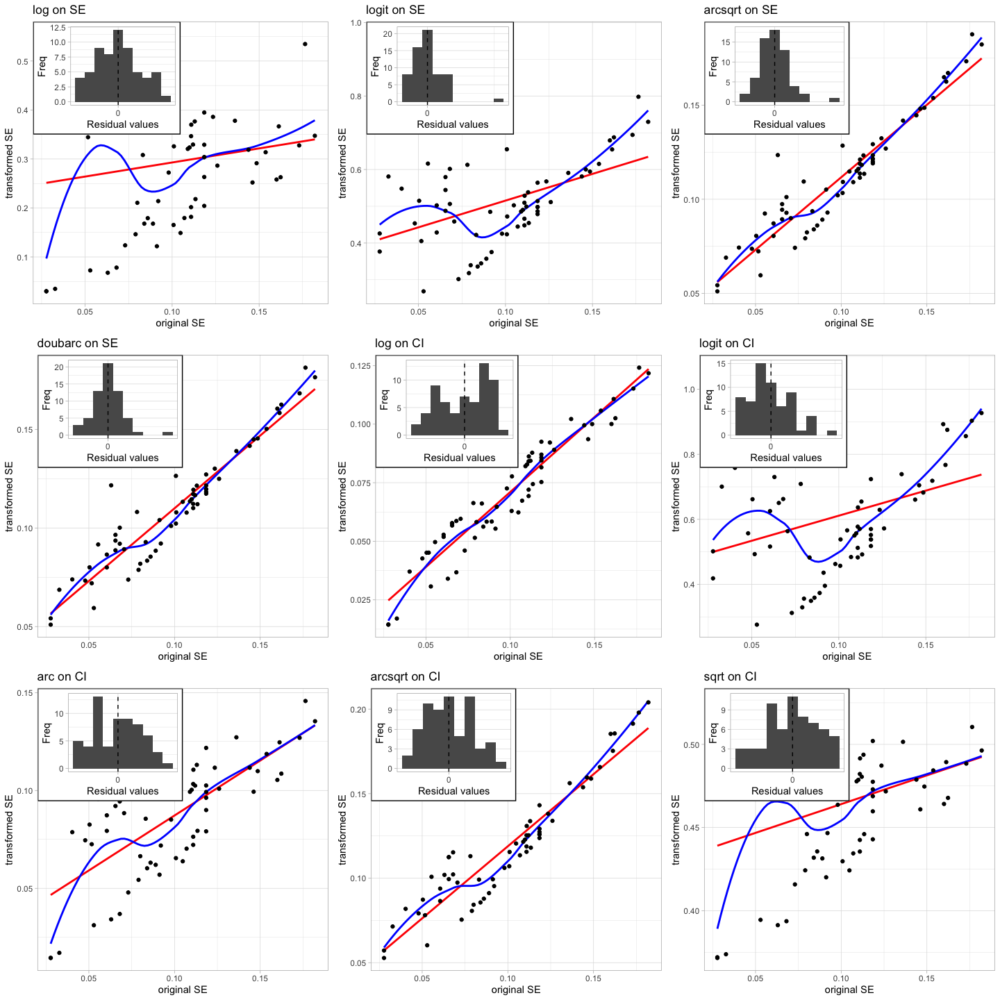
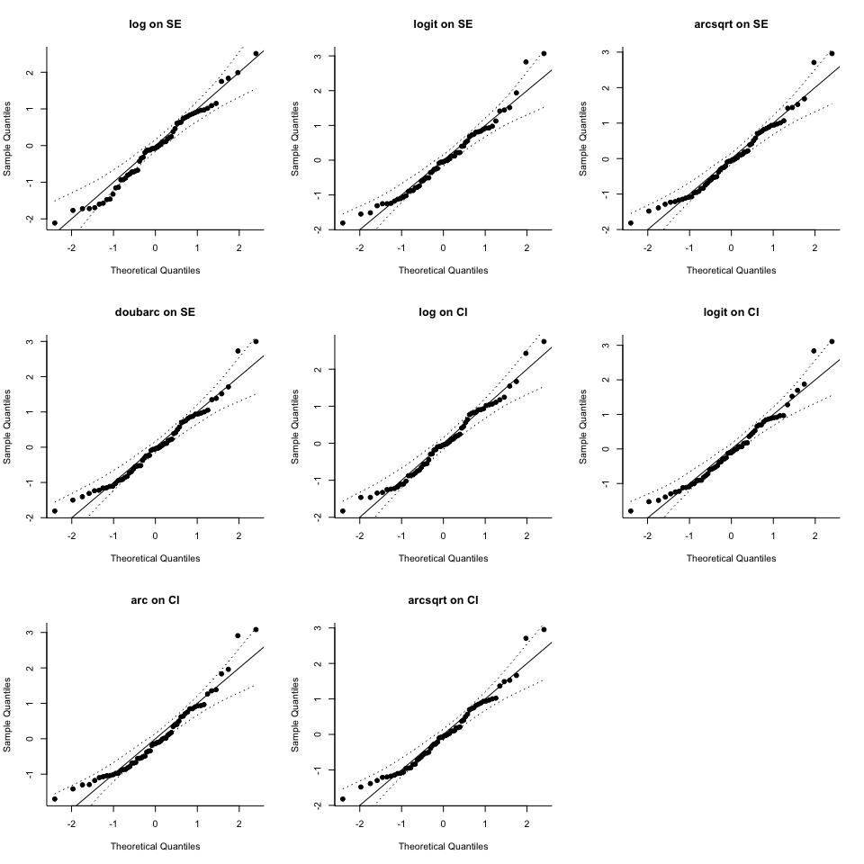
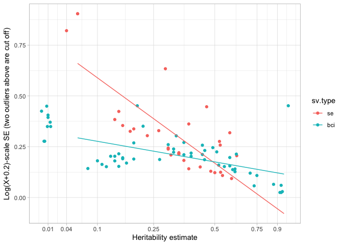

<head>
<script src="https://cdn.mathjax.org/mathjax/latest/MathJax.js?config=TeX-AMS-MML_HTMLorMML" type="text/javascript"></script>
</head>

``` r
setwd("~/Documents/PhD Thesis/Heritability meta-analysis")
# knitr::opts_knit$set(base.dir = "/Documents/PhD Thesis/Heritability meta-analysis", base.url = "/")
# knitr::opts_chunk$set(fig.path = "docs/images")
```

<style>
.container { width: 1000px; }
h2 { color: #f8f8f8; background-color: #437FAA; }
h3 { color: #f8f8f8; background-color: #437FAA; text-align: center; }
<!-- Get highlight from Terminal: pandoc --print-highlight-style tango -->
</style>

------------------------------------------------------------------------

``` r
rm(list=ls())

## Install the required packages if not previously installed, e.g.:
# if(!require("readxl")) install.packages("readxl")
library(readxl)
library(tidyverse); theme_set(theme_light())
```

    ## ── Attaching packages ──────────────────────────────────────────────── tidyverse 1.3.0 ──

    ## ✓ ggplot2 3.3.5     ✓ purrr   0.3.4
    ## ✓ tibble  3.0.3     ✓ dplyr   1.0.2
    ## ✓ tidyr   1.1.2     ✓ stringr 1.4.0
    ## ✓ readr   1.3.1     ✓ forcats 0.5.0

    ## ── Conflicts ─────────────────────────────────────────────────── tidyverse_conflicts() ──
    ## x dplyr::filter() masks stats::filter()
    ## x dplyr::lag()    masks stats::lag()

``` r
library(metafor)
```

    ## Loading required package: Matrix

    ## 
    ## Attaching package: 'Matrix'

    ## The following objects are masked from 'package:tidyr':
    ## 
    ##     expand, pack, unpack

    ## Loading 'metafor' package (version 2.4-0). For an overview 
    ## and introduction to the package please type: help(metafor).

``` r
library(grid)
library(gridExtra)
```

    ## 
    ## Attaching package: 'gridExtra'

    ## The following object is masked from 'package:dplyr':
    ## 
    ##     combine

``` r
library(quantreg)
```

    ## Loading required package: SparseM

    ## 
    ## Attaching package: 'SparseM'

    ## The following object is masked from 'package:base':
    ## 
    ##     backsolve

    ## Warning in .recacheSubclasses(def@className, def, env): undefined subclass
    ## "numericVector" of class "Mnumeric"; definition not updated

``` r
source('~/Documents/PhD Thesis/Heritability meta-analysis/Functions/useful_functions.R')
# using qlogis() for logit, plogis() for inverse logit

data <- read_excel("../Data/heritability_estimates.xlsx", sheet="h2")

# create factor of different sampling variance types, relevel to have se on top
data <- data %>% mutate(sv.type = factor(case_when(
    !is.na(se)      ~ "se",
    !is.na(bci.lwr) ~ "bci",
    TRUE            ~ "none"))) %>%
    within({sv.type = relevel(sv.type, ref="se")}) %>%
    filter(not.valid==0) # delete ones that don't have valid h2s

data$est.id <- factor(1:nrow(data)) # assign individual estimate numbers
```

# Different measures of sampling variance

Data transformation is necessary for analyses of proportions in order to
avoid boundary issues when proportions are nearby 0 and 1. They also aid
in producing data that is closer to gaussian-distributed, allowing
better estimation of parameters in random effect meta-analysis.

The main issue with data transformation arises in the fact that we have
three main sampling variance (herein referred to as *SV*, i.e. the
square of the standard error of the mean) types, namely, sampling
variance is reported as either:

-   standard error of the mean (herein *SE*)
-   confidence or bayesian credible intervals (*CI*)
-   no estimate of sampling variance (*none*)

Using the equation for calculating 95% confidence intervals
(*p* ± *z*<sup>\*</sup> ⋅ *S**E*(*p*)), we can convert *SE* to *CI*, or
vice-versa, then conduct a transformation on only *SE*s or *CI*s. These
two classes of transformations both have important caveats. Direct
transformations of *SE* are more typical for meta-analyses of
proportions (Wang 2018), and have the advantage that no *SE* is too
large to transform to a new scale. However, going from *CI* to *SE*
sacrifices the asymmetry implicit in many bayesian posteriors, which
would otherwise be somewhat maintained if directly converting *CI*s to a
different scale. Additionally, most *SE*-transforms for binomial data
require a sample size *n*, which is not an observed quantity for
proportions such as heritability– a ratio of two variances and thus an
inherent proportion with no associated sample size.

Alternatively, we can change *SE*s to *CI*s and transform both the point
estimate and the upper and lower bounds provided by the 95% *CI* to get
to the new scale. This allows us to keep the implicit asymmetry of many
posterior estimates of *h*<sup>2</sup> calculated using MCMCglmm, but
for some estimates where the *SE* is large, no transformation is
possible, as either the upper and/or lower bound is outside of the range
from \[0,1\] in many cases. Additionally, if
*p* ± *z*<sup>\*</sup> ⋅ *S**E*(*p*) happens to create values very close
but within 0 or 1, then upon logit transformation, these values tend to
have exceedingly high logit-scale *SE* values.

Thus, the issues of transformation are not perfect through either
approach. We thus compare a number of transformations computed using
both *SE*- and *CI*-transformations. and finish by comparing the main
results from each model to assess their robustness.

# Transformations

## SE-transformations

Two different classes of transforms are possible in our data: converting
directly from *SE*s to the transformed scale using either the logit
(a.k.a. log-odds, Delta-logit), logarithmic, arcsine square root, and
Freeman-Tukey double arcsine transformations. These transformations are
automatically conducted using the `metafor::escalc()` function, however,
they require the calculation of a pseudo-sample size for each
heritability estimate, when these in reality do not exist for an
inherent proportion, or at least not in the way that binomial
proportions do. To bypass this, we can estimate a rough binomial *n*
using a rearrangement of the following formula for the expected sampling
variance of a proportion:
$$SE(p) = \\sqrt{\\frac{p(1-p)}{n}}$$
thus:
$$ n\_{estimate} \\approx \\frac{p(1-p)}{SE(p)^2}$$
We can then directly transform all point estimates and *SE*s to other
scales. Here, we will only cover the formulae for two methods outlined
Wang (2018): the logit-Delta and double arcsine transform.

### Logit-Delta transform

The logit point-estimate transform is simply the logit of the proportion
*p*, $p\_{logit} = ln\\left( \\frac{p}{1-p} \\right)$ with the sampling
variance:
$$ SE(p\_{logit})^2 = \\frac{1}{n\_{est} \\, p}+ \\frac{1}{n\_{est} \\, (1-p)} $$
This transform has the known caveat of variance instability such that
studies closer to 0.5 may have undue weight placed upon their estimates
due to the narrowing of sampling variance (Barendregt et al. 2013; Hamza
et al. 2008). Additionally, extreme estimates close to 0 or 1 become
undefined upon logit-transformed. However, both of these problems can be
solved using the variance-stabilizing double arcsine transform (Wang
2018).

### Double-arcsine transform

$$ p\_{double-arcsine} =  \\frac{1}{2} \\left( sin^{-1} \\sqrt{\\frac{np}{n+1}}+sin^{-1} \\sqrt{\\frac{np+1}{n+1}} \\right)  $$
And sampling variance:
$$ SE(p\_{double-arcsine})^2 = \\frac{1}{4n+2} $$
However, the double-arcsine transformation has no tractable
back-transformation method (Wang 2018), and back-estimates have been
criticized for producing nonsensical *SE* values on the original scale.

The following advice was provided by Lipsey and Wilson (2001) and
Viechtbauer (2010) regarding the transforms: proportions between 0.2 to
0.8 can be analyzed without tranform, proportions lying outside the
range of 0.2-0.8 can be transformed via logit, and double arcsine when
the sample size is small or when proportions are even more extreme.

## CI-transformations

SE-transformations were developed for binomial proportions, not
continuous quantities constrained to fall between zero and 1, like
heritabiity, that require the back-calculation of a pseudo-sample size.
However, instead of converting all sampling variances to *SE*, we can
instead go in the opposite direction and change *SE*s to 95% *CI*s to
transform these upper and lower interval boundaries directly. We used
95% CIs instead of other intervals as all papers using the `MCMCglmm`
package and animal model ubiquitously reported 95% bayesian credible
intervals.

Then, once the *CI*s are on the transformed scale, we simply
back-calculate *SE* from the original equation for 95% *CI*s using half
the range:
$$ SE(p\_{trans}) \\simeq \\frac{\\frac{1}{2} range(95\\% \\, CI\_{trans})}{t^\*} $$
where *t*<sup>\*</sup> = 1.98 for large sample sizes (e.g., n=100,
`qt(0.975, 100)`=1.98). In this way, we can transform values to new
scales using many different common transformations, such as log+1,
logit, arcsine, arcsine-square-root, and square-root+1 transformations.
log+1 and square-root+1 have additions of 1 since some of the lower
confidence intervals fall below 0.

The transformation for each is applied directly to the point estimates
and lower and upper *CI* bounds using the respective R functions:
`log(x+1)`, `qlogis(x)`, `asin(x)`, `asin(sqrt(x))`, and `sqrt(x+1)`.

## Calculating each transformation

Next, we calculate each of the above-mentioned transforms, comparing
only well-behaved proportions with upper and lower *CI* bounds between
0.001-0.999 exclusive.

``` r
#### Transformations on SE (+impute sample n) ####

# calculate SEs from BCIs, call them se.t
data <- data %>% mutate(
        se.t = case_when(
            sv.type == "bci" ~ (bci.upr - bci.lwr) / (2*qt(0.975, 100)),
            sv.type == "se"  ~ se,
            TRUE ~ NA_real_),
        n.pseudo = case_when( # n = p(1-p)/(se^2)
            sv.type != "none" ~ (val*(1-val))/(se.t^2), 
            # sampling variance of a population's proportion is: 
            # SV = SE^2 = p*(1-p)/n; (Lipsey and Wilson 2001)
            TRUE ~ NA_real_)) %>%
# transform using log transformed proportion
    escalc(xi=val*n.pseudo, ni=n.pseudo, data=., measure="PLN") %>%
    rename(val.logse = yi, vi.logse = vi) %>% 
    mutate(se.logse = sqrt(vi.logse)) %>%
# transform using logit-delta on SE 
    escalc(xi=val*n.pseudo, ni=n.pseudo, data=., measure="PLO") %>%
    rename(val.logitse = yi, vi.logitse = vi) %>% 
    mutate(se.logitse = sqrt(vi.logitse)) %>%
# transform using arcsine-sqrt on SE
    escalc(xi=val*n.pseudo, ni=n.pseudo, data=., measure="PAS") %>%
    rename(val.arcsqrtse = yi, vi.arcsqrtse = vi) %>% 
    mutate(se.arcsqrtse = sqrt(vi.arcsqrtse)) %>%
# transform using Freeman-Tukey double arcsine on SE    
    escalc(xi=val*n.pseudo, ni=n.pseudo, data=., measure="PFT", add=0) %>%
    rename(val.doubarcse = yi, vi.doubarcse = vi) %>% 
    mutate(se.doubarcse = sqrt(vi.doubarcse)) %>%
    
    select(-c(vi.logse, vi.logitse, vi.arcsqrtse, vi.doubarcse))
    

#### Transformations on CI  ####

## Four steps for all transformations:
# [1] Directly convert point estimates;
# [2] Transform SEs to 95% CIs; 
# [3] if BCI/CIs not outside of 0.001-0.999 range (i.e. valid)...
#     (extreme 95% CI values often happen by chance when converting SE to 
#     95% CI, so exclude them and use half-range to avoid inflating SE)
# [4] Transform CIs, get SE on transformed scale as half the 95%CI range 
#     divided by 1.98 for large sample sizes (n=100)

# 
dat <- data %>% 
    mutate(
    val.logitci = qlogis(val),  # [1]
    val.logci = log1p(val),
    val.arcci = asin(val),
    val.arcsqrtci = asin(sqrt(val)),
    val.sqrtci = sqrt(val+1),
    ci.lwr.t = case_when(       # [2]
        sv.type == "bci" ~ bci.lwr,
        sv.type == "se"  ~ val-qt(0.975, 100)*se,
        TRUE ~ NA_real_),
    ci.upr.t = case_when(       # [2]
        sv.type == "bci" ~ bci.upr,
        sv.type == "se"  ~ val+qt(0.975, 100)*se,
        TRUE ~ NA_real_),
    ci.lwr.logit.valid = ifelse(sv.type != "none" & ci.lwr.t > 0.001, T, F),
    ci.upr.logit.valid = ifelse(sv.type != "none" & ci.upr.t < 0.999, T, F)) %>%
    filter(ci.lwr.logit.valid==TRUE & ci.upr.logit.valid==TRUE) %>%
    mutate(
        se.logci = (log1p(ci.upr.t) - log1p(ci.lwr.t)) / (2*qt(0.975, 100)),# [4] log+1
        se.logitci = (qlogis(ci.upr.t) - qlogis(ci.lwr.t)) / (2*qt(0.975, 100)), # [4] logit
        se.arcci = (sqrt((ci.upr.t)) - sqrt((ci.lwr.t))) / (2*qt(0.975, 100)), # [4] arcsine
        se.arcsqrtci = (asin(sqrt(ci.upr.t)) - asin(sqrt(ci.lwr.t))) / (2*qt(0.975, 100)), # [4] arcsine-sqrt
        se.sqrtci = (sqrt((ci.upr.t)+1) - sqrt((ci.lwr.t))+1) / (2*qt(0.975, 100)) # [4] sqrt+1
    ) %>%
    select(-c( ci.lwr.logit.valid, ci.upr.logit.valid))

# assign("last.warning", NULL, envir = baseenv())

# create a new data frame to manipulate:
# (and avoid gamete contribution trait, which contains only a single h2)
data.t <- dat %>% filter(trait != "gamete contribution")
```

# Plotting the different transformations

Next, we compare each of the eight transformations via plotting. We
produce three main diagnostic plots, namely:

1.  SE of original vs. transformed SE (should scale roughly linearly)
2.  QQ-plots from initial model fits (transformed\_y \~ h2 type \* trait
    type)
3.  Coefficient plots comparing relative parameter estimates for initial
    model fits

## Original vs. transformed SE

    ## `geom_smooth()` using formula 'y ~ x'
    ## `geom_smooth()` using formula 'y ~ x'
    ## `geom_smooth()` using formula 'y ~ x'
    ## `geom_smooth()` using formula 'y ~ x'
    ## `geom_smooth()` using formula 'y ~ x'
    ## `geom_smooth()` using formula 'y ~ x'
    ## `geom_smooth()` using formula 'y ~ x'
    ## `geom_smooth()` using formula 'y ~ x'
    ## `geom_smooth()` using formula 'y ~ x'
    ## `geom_smooth()` using formula 'y ~ x'
    ## `geom_smooth()` using formula 'y ~ x'
    ## `geom_smooth()` using formula 'y ~ x'
    ## `geom_smooth()` using formula 'y ~ x'
    ## `geom_smooth()` using formula 'y ~ x'
    ## `geom_smooth()` using formula 'y ~ x'
    ## `geom_smooth()` using formula 'y ~ x'
    ## `geom_smooth()` using formula 'y ~ x'
    ## `geom_smooth()` using formula 'y ~ x'
    ## `geom_smooth()` using formula 'y ~ x'
    ## `geom_smooth()` using formula 'y ~ x'
    ## `geom_smooth()` using formula 'y ~ x'
    ## `geom_smooth()` using formula 'y ~ x'
    ## `geom_smooth()` using formula 'y ~ x'
    ## `geom_smooth()` using formula 'y ~ x'
    ## `geom_smooth()` using formula 'y ~ x'
    ## `geom_smooth()` using formula 'y ~ x'
    ## `geom_smooth()` using formula 'y ~ x'
    ## `geom_smooth()` using formula 'y ~ x'
    ## `geom_smooth()` using formula 'y ~ x'
    ## `geom_smooth()` using formula 'y ~ x'
    ## `geom_smooth()` using formula 'y ~ x'
    ## `geom_smooth()` using formula 'y ~ x'
    ## `geom_smooth()` using formula 'y ~ x'
    ## `geom_smooth()` using formula 'y ~ x'
    ## `geom_smooth()` using formula 'y ~ x'
    ## `geom_smooth()` using formula 'y ~ x'
    ## `geom_smooth()` using formula 'y ~ x'
    ## `geom_smooth()` using formula 'y ~ x'
    ## `geom_smooth()` using formula 'y ~ x'
    ## `geom_smooth()` using formula 'y ~ x'
    ## `geom_smooth()` using formula 'y ~ x'
    ## `geom_smooth()` using formula 'y ~ x'
    ## `geom_smooth()` using formula 'y ~ x'
    ## `geom_smooth()` using formula 'y ~ x'
    ## `geom_smooth()` using formula 'y ~ x'
    ## `geom_smooth()` using formula 'y ~ x'
    ## `geom_smooth()` using formula 'y ~ x'
    ## `geom_smooth()` using formula 'y ~ x'
    ## `geom_smooth()` using formula 'y ~ x'
    ## `geom_smooth()` using formula 'y ~ x'
    ## `geom_smooth()` using formula 'y ~ x'
    ## `geom_smooth()` using formula 'y ~ x'
    ## `geom_smooth()` using formula 'y ~ x'
    ## `geom_smooth()` using formula 'y ~ x'

<!-- -->

We can see clearly that some transformations, such as the logarithmic-CI
transform, produces the most linear and predictable increase in points.
However, note that two outliers are obscured by the residual values plot
in the top left of the plot, so it isn’t perfect either.

## QQ-plots from an initial mixed meta-model

<!-- -->

Not sure what is wrong with the sqrt on CI transform line… Seems to be
an error.

Similarly, the log(X+1)-CI transformation (**log on SE** above) produces
transformed SE values and associated residual values that are more
Gaussian-distributed relative to other transformations.

## Coefficient plots

<!-- -->

Finally, the log-CI transformation produces model coefficients that are
similar to other transformations, including a model using untransformed
proportions and associated SE. The SE-transforms all have fairly large
parameter SEs, and thus are not very precise relative to CI-transform
models.

Thus, we decided to use a log(X+C) transformation of the point estimate
and confidence intervals, where C is some positive constant.

------------------------------------------------------------------------

# Comparing transformation outcomes on statistical analysis

Next, we compare trait type only, additive (trait + stage type) and
interaction (trait x stage type) models of reported heritability across
each transformation to see if the results are similar or different
according to the transformation.

``` r
## Standard error-transform models (all models similar):
# Log-SE transform model:
myAIC(m.traitonly.logse, m.additive.logse, m.interaction.logse) # additive model favoured
myAIC(m.traitonly.logitse, m.additive.logitse, m.interaction.logitse) # trait only favoured
myAIC(m.traitonly.arcsqrtse, m.additive.arcsqrtse, m.interaction.arcsqrtse) # trait only favoured
myAIC(m.traitonly.doubarcse, m.additive.doubarcse, m.interaction.doubarcse) # trait only favoured
```

    ##                 model df      AICc     ΔAICc
    ## 1   m.traitonly.logse  8  99.95211  0.000000
    ## 2    m.additive.logse 10 104.91459  4.962486
    ## 3 m.interaction.logse 17 112.87684 12.924729
    ##                   model df     AICc    ΔAICc
    ## 1   m.traitonly.logitse  8 188.6467 0.000000
    ## 2    m.additive.logitse 10 193.5377 4.890936
    ## 3 m.interaction.logitse 17 198.0141 9.367406
    ##                     model df      AICc    ΔAICc
    ## 1   m.traitonly.arcsqrtse  8  3.356416 0.000000
    ## 2    m.additive.arcsqrtse 10  8.585938 5.229522
    ## 3 m.interaction.arcsqrtse 17 13.307156 9.950739
    ##                     model df      AICc    ΔAICc
    ## 1   m.traitonly.doubarcse  8 -1.000745  0.00000
    ## 2    m.additive.doubarcse 10  4.183765  5.18451
    ## 3 m.interaction.doubarcse 17  9.530047 10.53079

## Confidence interval-transform models

``` r
## Confidence interval-transform models (all models similar):
# Log-CI model:
myAIC(m.traitonly.logci, m.additive.logci, m.interaction.logci) # trait only favoured
myAIC(m.traitonly.logitci, m.additive.logitci, m.interaction.logitci) # trait only favoured
myAIC(m.traitonly.arcci, m.additive.arcci, m.interaction.arcci) # trait only favoured
myAIC(m.traitonly.arcsqrtci, m.additive.arcsqrtci, m.interaction.arcsqrtci) # trait only favoured
```

    ##                 model df      AICc     ΔAICc
    ## 1   m.traitonly.logci  8 -58.23180  0.000000
    ## 2    m.additive.logci 10 -53.40071  4.831087
    ## 3 m.interaction.logci 17 -46.12689 12.104901
    ##                   model df     AICc    ΔAICc
    ## 1   m.traitonly.logitci  8 190.8995 0.000000
    ## 2    m.additive.logitci 10 196.1440 5.244444
    ## 3 m.interaction.logitci 17 199.9913 9.091718
    ##                 model df     AICc    ΔAICc
    ## 1   m.traitonly.arcci  8 18.98508 0.000000
    ## 2 m.interaction.arcci 17 23.80001 4.814929
    ## 3    m.additive.arcci 10 24.91838 5.933297
    ##                     model df      AICc    ΔAICc
    ## 1   m.traitonly.arcsqrtci  8  4.545814 0.000000
    ## 2    m.additive.arcsqrtci 10  9.909823 5.364009
    ## 3 m.interaction.arcsqrtci 17 14.460938 9.915124

## Untransformed model with no imputed SE

``` r
## Untransformed model with no imputed SE:
myAIC(m.traitonly.notrans, m.additive.notrans, m.interaction.notrans) # trait only favoured
```

    ##                   model df      AICc     ΔAICc
    ## 1   m.traitonly.notrans  8 -9.645865  0.000000
    ## 2    m.additive.notrans 10 -4.531493  5.114372
    ## 3 m.interaction.notrans 17  1.105530 10.751396

All models have similar results! So the transformation of CI does not
affect results relative to untransformed, but the SE transform appears
to change the outcome (and select a more complicated model).

We decided on the log(X+1) CI-transform in the end, due to its
well-behaved properties seen previously as well as its versatility in
allowing the transformation of heritability estimates with a lower
confidence interval up to -1 and for any upper confidence interval!
However, the amount being added (currently ‘+1’ but it could be any
quantity, ‘+C’) is arbitrary, thus we next optimize for the contstant
being added, C.

------------------------------------------------------------------------

# Comparing log X+C transforms

In this section, we examine the effect of varying the added constant ‘C’
on the resulting log-transformation, considering how many data points
would have to be excluded due to their lower CI being less than -C (and
thus not being log-transformable!).

To do so, we plot the lowest rounded value of C and the resulting
transformation when 1 to 6 of the lowest CI values are excluded.

    ## Warning: Problem with `mutate()` input `se.logpZ`.
    ## ℹ NaNs produced
    ## ℹ Input `se.logpZ` is `case_when(...)`.

    ## Warning in log(ci.lwr.t + Z[i]): NaNs produced

    ## Warning: Problem with `mutate()` input `se.logpZ`.
    ## ℹ NaNs produced
    ## ℹ Input `se.logpZ` is `case_when(...)`.

    ## Warning in log(ci.lwr.t + Z[i]): NaNs produced

    ## Warning: Problem with `mutate()` input `se.logpZ`.
    ## ℹ NaNs produced
    ## ℹ Input `se.logpZ` is `case_when(...)`.

    ## Warning in log(ci.lwr.t + Z[i]): NaNs produced

    ## Warning: Problem with `mutate()` input `se.logpZ`.
    ## ℹ NaNs produced
    ## ℹ Input `se.logpZ` is `case_when(...)`.

    ## Warning in log(ci.lwr.t + Z[i]): NaNs produced

    ## Warning: Problem with `mutate()` input `se.logpZ`.
    ## ℹ NaNs produced
    ## ℹ Input `se.logpZ` is `case_when(...)`.

    ## Warning in log(ci.lwr.t + Z[i]): NaNs produced

%20transforms-1.png)<!-- -->

Due to the limited number of exclusions while having more well-behaved
residuals, we opt for setting C=0.2 and using a log(X+0.2)-CI
transformation for the remainder of our analyses.

We thus calculate new point estimates and associated SEs on the
log(X+0.2) scale by transforming the original estimate and calculated
CIs, then calculating the SEs from the transformed CIs. The new
variables ‘val.log’ (transformed estimate) and ‘se.log’ (transformed
standard error) are created below. Note: lower CI values less than 0.2
could not be computed using a log(X+0.2) transformation and thus are set
to NA and required imputation later on.

``` r
data <- data %>% 
    mutate(
    val.log = log(val+0.2),
    ci.lwr.logpX.valid = 
        ifelse(sv.type != "none" & ci.lwr.t > -0.2, TRUE, FALSE), # [3]
    se.log = case_when(     # [4] log(X+0.2) transform
        ci.lwr.logpX.valid == TRUE ~
            (log(ci.upr.t+0.2) - log(ci.lwr.t+0.2)) / (2*qt(0.975, 100)),
        # ci.lwr.logpX.valid == FALSE ~
        #   (log(ci.upr.t+Z[i]) - val.logpZ)/qt(0.975, 100),
        TRUE ~ NA_real_))
```

    ## Warning: Problem with `mutate()` input `se.log`.
    ## ℹ NaNs produced
    ## ℹ Input `se.log` is `case_when(...)`.

    ## Warning in log(ci.lwr.t + 0.2): NaNs produced

------------------------------------------------------------------------

# Imputing missing SE values

    ## `summarise()` ungrouping output (override with `.groups` argument)
    ## `summarise()` ungrouping output (override with `.groups` argument)
    ## `summarise()` ungrouping output (override with `.groups` argument)

### Best predictors of sampling variance

We next aim to predict the value of missing SE values. There were 3
excluded values due to the log(X+0.2)-CI transformation, while 4 values
never had any SE or BCI estimate.

``` r
data %>% group_by(sv.type, is.na(se.log)) %>% count 
```

    ## # A tibble: 4 x 3
    ## # Groups:   sv.type, is.na(se.log) [4]
    ##   sv.type `is.na(se.log)`     n
    ##   <fct>   <lgl>           <int>
    ## 1 se      FALSE              31
    ## 2 se      TRUE                3
    ## 3 bci     FALSE              57
    ## 4 none    TRUE                4

``` r
# 32 valid SEs; 3 invalid SEs (lower interval < 0.2, thus excluded)
# 56 valid BCIs; and 4 estimates with no originally-reported sampling variance
```

To decide on how to impute, we fit a number of linear models, but the
simplest one without including fixed effects is: transformed SE \~
transformed h2 x sampling variance type (SE or BCI).

``` r
lm(se.log ~ val.log * sv.type, data=data.ts, na.action = na.omit) %>% summary
```

    ## 
    ## Call:
    ## lm(formula = se.log ~ val.log * sv.type, data = data.ts, na.action = na.omit)
    ## 
    ## Residuals:
    ##      Min       1Q   Median       3Q      Max 
    ## -0.14604 -0.08155 -0.02415  0.05415  0.33977 
    ## 
    ## Coefficients:
    ##                     Estimate Std. Error t value Pr(>|t|)    
    ## (Intercept)        -0.008119   0.042283  -0.192  0.84819    
    ## val.log            -0.495928   0.056608  -8.761 1.80e-13 ***
    ## sv.typebci          0.140701   0.048348   2.910  0.00462 ** 
    ## val.log:sv.typebci  0.376372   0.062419   6.030 4.24e-08 ***
    ## ---
    ## Signif. codes:  0 '***' 0.001 '**' 0.01 '*' 0.05 '.' 0.1 ' ' 1
    ## 
    ## Residual standard error: 0.1068 on 84 degrees of freedom
    ## Multiple R-squared:  0.5813, Adjusted R-squared:  0.5663 
    ## F-statistic: 38.87 on 3 and 84 DF,  p-value: 7.485e-16

<!-- -->

Plotting this relationship, we see that the transformed SE for studies
that report SE (often through the ANOVA method of calculating
*H*<sup>2</sup>/*h*<sup>2</sup>) are in general higher than the
transformed SE from studies originally reporting BCIs (often through the
Bayesian MCMCglmm method, which tends to be more precise).

Additionally, the overall tendancy is for precision to increase at
larger values of *H*<sup>2</sup>/*h*<sup>2</sup>.

### Quantile regression

Since most of the unknown values for sampling variance are unreported,
rather than excluded, we don’t know the original sampling variance type
in order to estimate them from the model. Additionally, they may have
been omitted due to their relatively high imprecision. **Thus, to be
conservative and reduce the impact of imputed SEs, we impute the
transformed SEs using a 95% quantile regression following the linear
relationship: log-SE \~ log-h2** to account for the decrease in
transformed SE values with increasing point estimates. Doing so ensures
that points have relatively high SE on the transformed scale, thus
down-weighting their relative influence on the analysis.

<!-- -->

``` r
qr.lm
```

    ## (Intercept)     val.log 
    ##   0.2424061  -0.4913913

The new imputed estimates (n=8) appear on the grey line determined by a
95% quantile-regression of the data, with the transformed heritability
point estimate as a predictor.

We now save this final transformed dataset with imputed SEs to be used
in subsequent analyses.

------------------------------------------------------------------------

# Save final values

``` r
# get new levels in order of each trait coefficient
final.model <- rma.mv(yi=val.log ~ trait-1, V=(se.log^2), 
                      random = ~1|study/est.id, data=data, method="REML", tdist=T)
new.levels <- data.frame(trait = gsub("trait","", x=names(coef(final.model))), 
                        est = coef(final.model), row.names=NULL) %>%
    arrange(est) %>% pull(trait) %>% as.character()


# Factor variables, select specific columns, arrange by trait type and h2 est
d <- data %>% 
    mutate(trait = fct_relevel(trait, new.levels),
           h2 = fct_relevel(heritability, "broad"),
           stage = fct_relevel(stage, "larvae", "juvenile"),
           growth.form = fct_relevel(growth.form, "corymbose"),
           sv.log = se.log^2) %>%
    select(study:region, stage:trait,
           relatedness.info:model.type,
           h2, val:bci.upr, sv.type, imputed.se,
           val.log, sv.log, se.log) %>%
    arrange(desc(trait), desc(val.log)) %>%
    mutate(est.id = factor(row_number())) # set unique estimate ID for rma.mv()


# save new data file
data.full <- d
save(data.full, file="../Data/heritability_estimates_processed.RData")
```

------------------------------------------------------------------------

R session info:

``` r
sessionInfo()
```

    ## R version 4.0.2 (2020-06-22)
    ## Platform: x86_64-apple-darwin17.0 (64-bit)
    ## Running under: macOS Catalina 10.15.4
    ## 
    ## Matrix products: default
    ## BLAS:   /Library/Frameworks/R.framework/Versions/4.0/Resources/lib/libRblas.dylib
    ## LAPACK: /Library/Frameworks/R.framework/Versions/4.0/Resources/lib/libRlapack.dylib
    ## 
    ## locale:
    ## [1] en_CA.UTF-8/en_CA.UTF-8/en_CA.UTF-8/C/en_CA.UTF-8/en_CA.UTF-8
    ## 
    ## attached base packages:
    ## [1] grid      stats     graphics  grDevices utils     datasets  methods  
    ## [8] base     
    ## 
    ## other attached packages:
    ##  [1] quantreg_5.67   SparseM_1.78    gridExtra_2.3   metafor_2.4-0  
    ##  [5] Matrix_1.3-4    forcats_0.5.0   stringr_1.4.0   dplyr_1.0.2    
    ##  [9] purrr_0.3.4     readr_1.3.1     tidyr_1.1.2     tibble_3.0.3   
    ## [13] ggplot2_3.3.5   tidyverse_1.3.0 readxl_1.3.1   
    ## 
    ## loaded via a namespace (and not attached):
    ##  [1] Rcpp_1.0.5         lubridate_1.7.9    lattice_0.20-41    utf8_1.1.4        
    ##  [5] assertthat_0.2.1   digest_0.6.28      R6_2.5.1           cellranger_1.1.0  
    ##  [9] backports_1.1.10   MatrixModels_0.4-1 reprex_0.3.0       evaluate_0.14     
    ## [13] httr_1.4.2         pillar_1.4.6       rlang_0.4.11       rstudioapi_0.11   
    ## [17] blob_1.2.1         rmarkdown_2.5      labeling_0.3       splines_4.0.2     
    ## [21] munsell_0.5.0      broom_0.7.0        compiler_4.0.2     modelr_0.1.8      
    ## [25] xfun_0.17          pkgconfig_2.0.3    mgcv_1.8-33        htmltools_0.5.0   
    ## [29] tidyselect_1.1.0   matrixStats_0.56.0 fansi_0.4.1        crayon_1.3.4      
    ## [33] conquer_1.0.2      dbplyr_1.4.4       withr_2.2.0        nlme_3.1-149      
    ## [37] jsonlite_1.7.2     gtable_0.3.0       lifecycle_0.2.0    DBI_1.1.0         
    ## [41] magrittr_2.0.1     scales_1.1.1       cli_2.0.2          stringi_1.5.3     
    ## [45] farver_2.0.3       fs_1.5.0           xml2_1.3.2         ellipsis_0.3.1    
    ## [49] generics_0.0.2     vctrs_0.3.4        tools_4.0.2        glue_1.4.2        
    ## [53] hms_0.5.3          yaml_2.2.1         colorspace_1.4-1   rvest_0.3.6       
    ## [57] knitr_1.29         haven_2.3.1
